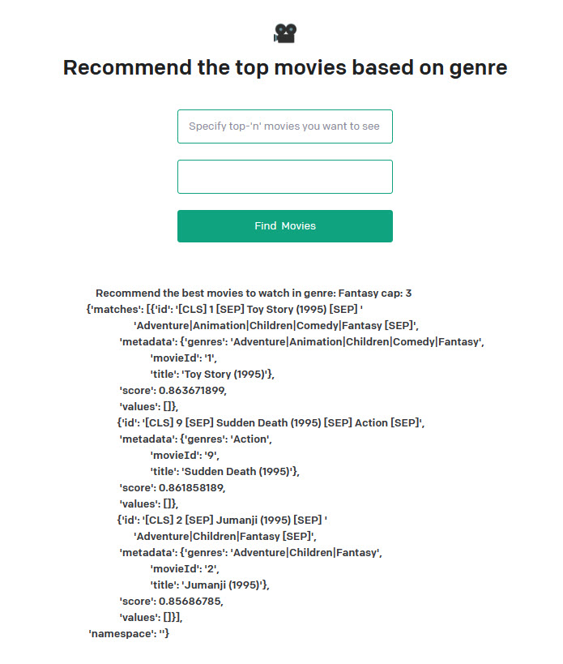

The goal of the application is to create a movie recommendation system that can take any user input and transform it into a movie genre, then search for the best movies in that genre using a vector-based index. The application uses a combination of tools based on LLMAgents and language models to achieve this goal.

The objectives accomplished by the application are:

- Creating an index of movies with their titles, genres, and embeddings using Pinecone and OpenAI Embedding API .
- Defining a custom agent class that can plan and execute actions based on the user input and intermediate steps.
- Using a language model chain to generate prompts and parse outputs for the agent using LangChain.
- Using a tool function to transform any user input into a movie genre using FuzzyWuzzy.
- Using a tool function to search for the best movies in the genre using Pinecone query.
- Creating a web interface using FastAPI, Jinja2, and Starlette   that allows the user to interact with the agent and get movie recommendations.

Some possible extensions for this project are:

- Adding more tools and features to the agent, such as filtering movies by ratings, year, or popularity.
- Improving the accuracy and diversity of the genre transformer function by using a more advanced natural language understanding model.
- Enhancing the user experience by adding more interactivity and personalization to the web interface, such as displaying movie posters, trailers, or reviews.



To start the application run the script as follows:
```
$ python3 app.py
INFO:     Started server process [22548]
INFO:     Waiting for application startup.
2023-08-30 18:22:20,359 - index - INFO - Starting up...
INFO:     Application startup complete.
INFO:     Uvicorn running on http://127.0.0.1:5050 (Press CTRL+C to quit)
INFO:     127.0.0.1:42020 - "GET / HTTP/1.1" 200 OK
2023-08-30 18:23:48,248 - index - INFO - Received inputs: String: "Document your life. You can  learn many things", number: 3. genre: Documentary deciphered
INFO:     127.0.0.1:42024 - "POST /generate HTTP/1.1" 302 Found
INFO:     127.0.0.1:42024 - "GET /?result=Recommend%20the%20best%20movies%20to%20watch%20in%20genre:%20Documentary%20cap:%203%0A%7B%27matches%27:%20[%7B%27id%27:%20%27[CLS]%2014%20[SEP]%20Nixon%20(1995)%20[SEP]%20Drama%20[SEP]%27,%0A%20%20%20%20%20%20%20%20%20%20%20%20%20%20%27metadata%27:%20%7B%27genres%27:%20%27Drama%27,%0A%20%20%20%20%20%20%20%20%20%20%20%20%20%20%20%20%20%20%20%20%20%20%20%20%20%20%20%27movieId%27:%20%2714%27,%0A%20%20%20%20%20%20%20%20%20%20%20%20%20%20%20%20%20%20%20%20%20%20%20%20%20%20%20%27title%27:%20%27Nixon%20(1995)%27%7D,%0A%20%20%20%20%20%20%20%20%20%20%20%20%20%20%27score%27:%200.877726734,%0A%20%20%20%20%20%20%20%20%20%20%20%20%20%20%27values%27:%20[]%7D,%0A%20%20%20%20%20%20%20%20%20%20%20%20%20%7B%27id%27:%20%27[CLS]%209%20[SEP]%20Sudden%20Death%20(1995)%20[SEP]%20Action%20[SEP]%27,%0A%20%20%20%20%20%20%20%20%20%20%20%20%20%20%27metadata%27:%20%7B%27genres%27:%20%27Action%27,%0A%20%20%20%20%20%20%20%20%20%20%20%20%20%20%20%20%20%20%20%20%20%20%20%20%20%20%20%27movieId%27:%20%279%27,%0A%20%20%20%20%20%20%20%20%20%20%20%20%20%20%20%20%20%20%20%20%20%20%20%20%20%20%20%27title%27:%20%27Sudden%20Death%20(1995)%27%7D,%0A%20%20%20%20%20%20%20%20%20%20%20%20%20%20%27score%27:%200.871356726,%0A%20%20%20%20%20%20%20%20%20%20%20%20%20%20%27values%27:%20[]%7D,%0A%20%20%20%20%20%20%20%20%20%20%20%20%20%7B%27id%27:%20%27[CLS]%2027%20[SEP]%20Now%20and%20Then%20(1995)%20[SEP]%20Children%7CDrama%20%27%0A%20%20%20%20%20%20%20%20%20%20%20%20%20%20%20%20%20%20%20%20%27[SEP]%27,%0A%20%20%20%20%20%20%20%20%20%20%20%20%20%20%27metadata%27:%20%7B%27genres%27:%20%27Children%7CDrama%27,%0A%20%20%20%20%20%20%20%20%20%20%20%20%20%20%20%20%20%20%20%20%20%20%20%20%20%20%20%27movieId%27:%20%2727%27,%0A%20%20%20%20%20%20%20%20%20%20%20%20%20%20%20%20%20%20%20%20%20%20%20%20%20%20%20%27title%27:%20%27Now%20and%20Then%20(1995)%27%7D,%0A%20%20%20%20%20%20%20%20%20%20%20%20%20%20%27score%27:%200.862330437,%0A%20%20%20%20%20%20%20%20%20%20%20%20%20%20%27values%27:%20[]%7D],%0A%20%27namespace%27:%20%27%27%7D HTTP/1.1" 200 OK
INFO:     127.0.0.1:46332 - "GET /favicon.ico HTTP/1.1" 404 Not Found
^CINFO:     Shutting down
INFO:     Waiting for application shutdown.
2023-08-30 18:27:08,554 - index - INFO - Shutting down...
INFO:     Application shutdown complete.
INFO:     Finished server process [22548]
```

